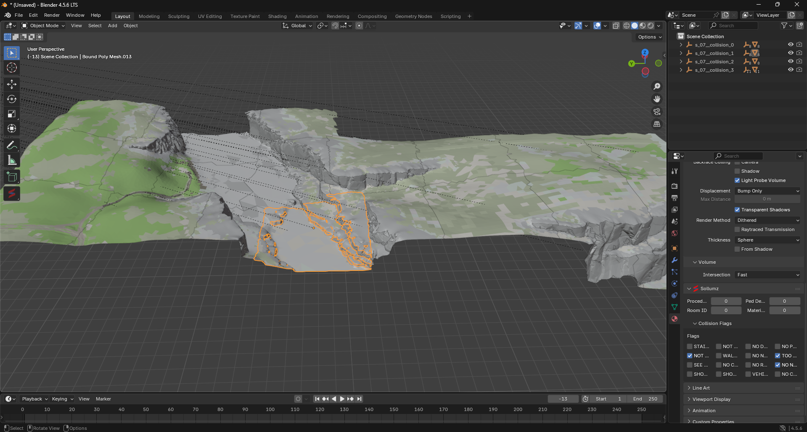
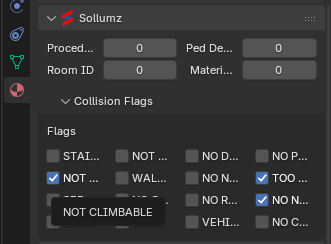
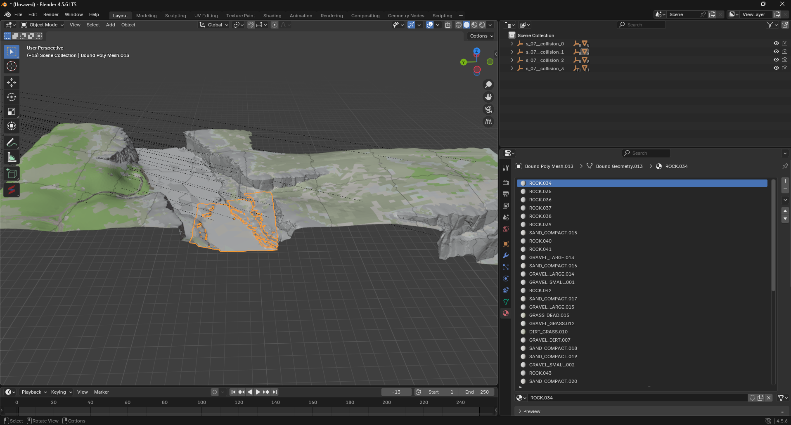

# Intro
When using a custom navmesh, it is important to update the collision (.ybn) material flags and re-stream the updated .ybn in order to properly support the new navmesh.  
This is important in the case of a navmesh tile being placed on the edge of the world or outside the vanilla playable area (i.e. Nuevo Paraiso, "Canada", etc.) to ensure your navmesh works as intended.  

Here are some important flags to consider. Flags can be viewed inside Blender (Object Mode -> Select Collision Tile -> Material Properties -> Sollumz -> Collision Flags) or a full list found [here](#list-of-flags). 
Keep in mind most are untested and are assumed usage. Feel free to document these flags to confirm usage:  

- NO NAVMESH  
Disable support for navmesh.  

- NOT CLIMBABLE  
Untested, disables support for climable surfaces.  

- TOO STEEP FOR PLAYER  
Untested, enables "sliding" when getting close to cliff/map edges.  

- STAIRS  
Untested. Stairs?  

## Import .ybn.xml into Blender  
  * Extract the necessary .ybn files covering the area of your navmesh. If you are generating a navmesh from [readme.md](README.md), you should already have these files loaded in Blender.  
    1. While in Object Mode, SELECT (left click) a collision tile (bound poly mesh).  
         
    2. Navigate to Material Properties -> Sollumz -> Collision Flags dropdown.  
         
    3. For each MATERIAL listed on the bound geometry, update the collision flags.  
         
    4. Repeat for each collision tile, and subsequently each material for each tile. Do this for each collision tile that is used by your new navmesh.
    5. File -> Export CodeX .xml THEN Import .xml to Codex, extract new .ybn - Put .ybn in /stream/ folder and ensure the file for fxmanifest.lua
       
       
### List of flags
- STAIRS
- NOT CLIMBABLE
- SEE THROUGH
- SHOOT THROUGH
- NOT COVER
- WALKABLE PATH
- NO CAM COLLISION
- SHOOT THROUGH FX
- NO DECAL
- NO NAVMESH
- NO RAGDOLL
- VEHICLE WHEEL
- NO PTFX
- TOO STEEP FOR PLAYER
- NO NETWORK SPAWN
- NO CAM COLLISION ALLOW CLIPPING

